

  <picture>
    
  </picture>

  

  <a href="https://portfolio-luval-os.vercel.app">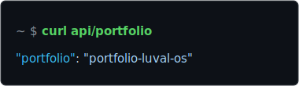</a>
  <a href="https://github.com/luvaldev">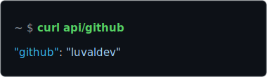</a>

  <a href="https://twitter.com/Luvaldev">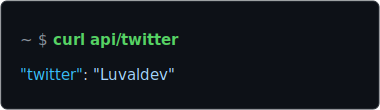</a>
  <a href="https://instagram.com/lwchito">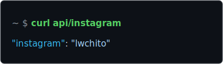</a>

 

  

  <a href="https://github.com/luvaldev/CampusSwap"></a>
  <a href="https://github.com/luvaldev/cercasco"></a>

  <a href="https://github.com/luvaldev/pulso-maq"></a>
  <a href="https://github.com/luvaldev/ivis-biotech"></a>

 

  

  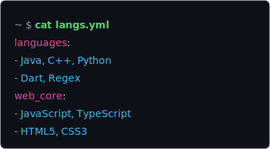
  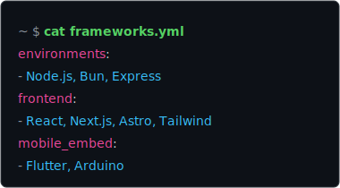

  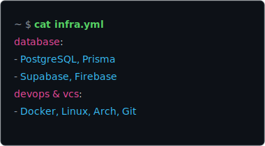
  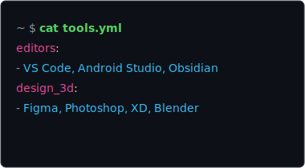

 

  

  <a href="https://github.com/Email-Infra-Forensics"></a>
  <a href="https://github.com/PternaSec"></a>

 

  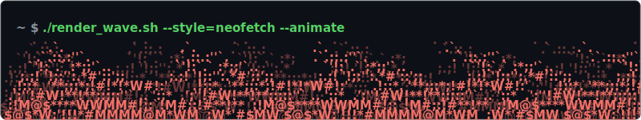

  ⭐️ From <a href="https://github.com/luvaldev">@luvaldev</a>

